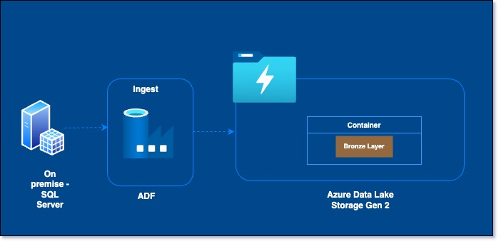
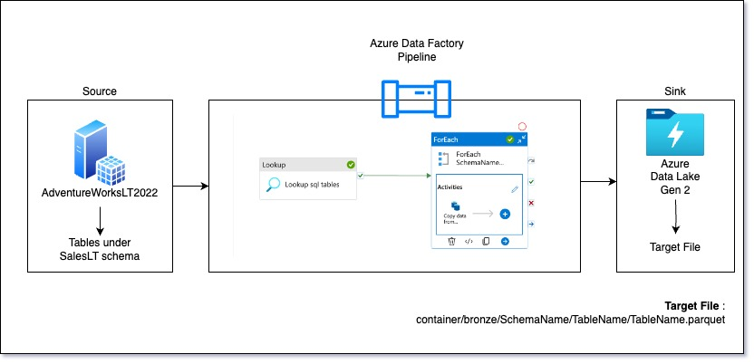
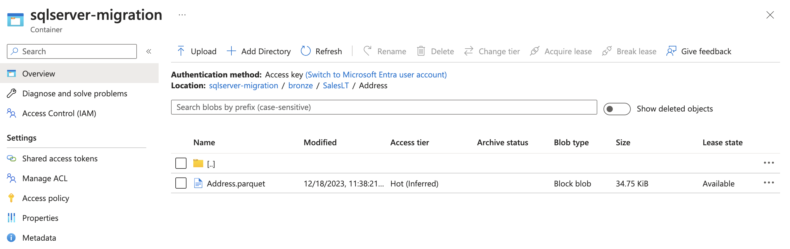

# DataMigration
This project is about migration sql server database to Azure SQL database.
\
Project is in progress.

## Solution Architecture

Alternative approach is to use Azure Synapse Analytics for the whole ELT process.

## Environment Set Up
1. Download the [AdventureWorksLT](https://learn.microsoft.com/en-us/sql/samples/adventureworks-install-configure?view=sql-server-ver16&tabs=ssms) back up file. The link has instructions to restore the file.
2. Set up user /password to access the database.
3. On the Azure portal , set up the subscription. Within the subscription set up Data Factory , Azure Data Lake Storage, SQL Database, [key vault](SetUp-AzureKeyVault).
4. Since there is on premises sql server being used in the project , a self hosted Integration run time needs to [set up](SetUp-IntegrationRunTime) to be able access the database. 
   

## Data Ingestion

#### Data Ingestion - Source Data
Only the below tables under the SalesLT schema in the AdventureWorksLT2022 database will be migrated as part of this project.\
Address \
Customer \
CustomerAddress \
Product \
ProductCategory \
ProductDescription \
ProductModel \
ProductModelProductDescription \
SalesOrderDetail \
SalesOrderHeader 

#### Data Ingestion - ADF - Copy Activity 

\
The ingest pipeline details have been described in detail [here](ADF-IngestPipeline).

#### Data Ingestion - Sink
The table data will be stored in parquet file format in the data lake.\
Naming Convention  : **sqlserver-migration / bronze/SchemaName /TableName/ TableName.parquet**

## Data Transformation using Databricks
Azure Databricks will be used to transform the data in azure datalake.
Since the source data is structured data , there is only minimal transformation to be done. In the first stage , data from bronze layer will be transformed to silver layer and finally , the aggregated data will be stored in the gold layer.

Follow the [link](<SetUp-Azure Databricks>) to set up the azure databricks workspace.

Before ingesting data into silver layer , below transformations are to be applied on bronze layer data .

| TableName | Transformation  |
| ------------- | ------------------|
| Address | Convert the ModifiedDate column to date type ; Drop rowguid column |
| Customer |Convert the ModifiedDate column to date type ; Drop rowguid column  |
| CustomerAddress | Convert the ModifiedDate column to date type ; Drop rowguid column|
| Product| Convert the ModifiedDate column to date type ; Drop rowguid column|
| ProductCategory| Convert the ModifiedDate column to date type ; Drop rowguid column|
| ProductDescription| Convert the ModifiedDate column to date type ; Drop rowguid column|
| ProductModel| Convert the ModifiedDate column to date type ; Drop rowguid column|
| ProductModelProductDescription| Convert the ModifiedDate column to date type ; Drop rowguid column|
| SalesOrderDetail| Convert the ModifiedDate column to date type ; Drop rowguid column|
| SalesOrderHeader| Convert the ModifiedDate column to date type ; Drop rowguid column|

Going into gold layer , columns will be renamed and business level aggregrations will be applied.

The databricks project code can be found [here](Code/DataBricks).

The two notebooks will be added to a data factory pipeline to automate the job fully.

## Data Loading using Azure Synapse Analytics
Azure synapse Analytics workspace was set up under a different resource group and a new data lake storage was created for easy clean up after project completion. 

In this step, the transformed data from the gold layer will be loaded to azure sql database in the Azure Synapse Workspace. This will be accomplished using the sql scripts and pipeline.

The code to create the views can be found [here](/Code/AzureSynapseAnalytics).

The steps involved in setting up the synapse workspace and the pipeline is described [here](/SetUp-AzureSynapseAnalytics).

## Data Reporting using Synapse Workspace and PowerBI

