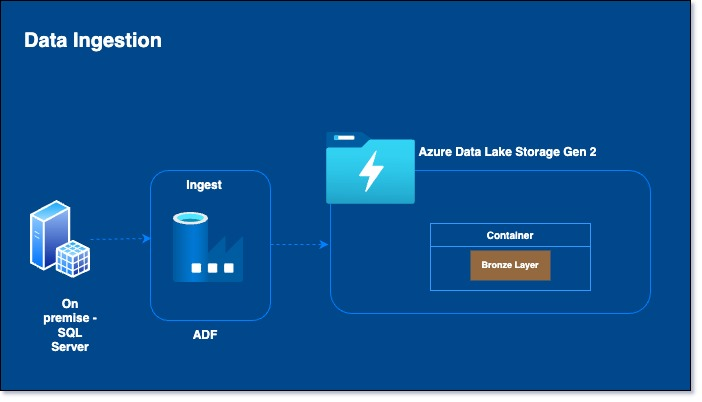

# DataMigration
This project is about migration sql server database to Azure SQL database.

Solution Architecture

Environment Set Up
1. Download the [AdventureWorksLT](https://learn.microsoft.com/en-us/sql/samples/adventureworks-install-configure?view=sql-server-ver16&tabs=ssms) back up file. The link has instructions to restore the file.
2. Set up user /password to access the database.
3. On the Azure portal , set up the subscription. Within the subscription set up Data Factory , Azure Data Lake Storage, SQL Database, key vault.
   

Data Ingestion

